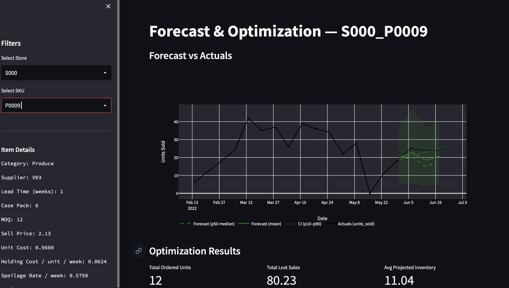

# Forecasting & Inventory Optimisation

An end-to-end demand forecasting and inventory optimisation pipeline for retail stores. The system trains a **DeepAR** probabilistic forecasting model on weekly sales data, then feeds the forecasts into a **Mixed-Integer Linear Program (MILP)** that determines optimal order quantities per store and SKU — minimising purchasing, holding, spoilage, and stockout costs. Results are explored through an interactive **Streamlit** dashboard.

---

## Tools & Tech Stack

| Category | Tool | Purpose |
|---|---|---|
| **Forecasting** | [GluonTS](https://ts.gluon.ai/) + [PyTorch Lightning](https://lightning.ai/) | DeepAR probabilistic time-series model |
| **Optimisation** | [PuLP](https://coin-or.github.io/pulp/) | MILP solver for inventory order planning |
| **Orchestration** | [Prefect](https://www.prefect.io/) | Pipeline orchestration & flow management |
| **Experiment Tracking** | [MLflow](https://mlflow.org/) | Model & metric tracking |
| **Configuration** | [Hydra](https://hydra.cc/) | YAML-based configuration management |
| **Dashboard** | [Streamlit](https://streamlit.io/) + [Plotly](https://plotly.com/) | Interactive visualisation |
| **Data** | [pandas](https://pandas.pydata.org/) | Data manipulation & feature engineering |
| **ML Utilities** | [scikit-learn](https://scikit-learn.org/), [LightGBM](https://lightgbm.readthedocs.io/), [skforecast](https://skforecast.org/) | Feature engineering & baseline models |
| **API** | [FastAPI](https://fastapi.tiangolo.com/) | REST API for serving predictions |
| **Packaging** | [uv](https://github.com/astral-sh/uv) | Fast Python dependency management |
| **Containerisation** | [Docker](https://www.docker.com/) | Reproducible deployment |
| **Linting** | [Ruff](https://docs.astral.sh/ruff/), [mypy](https://mypy-lang.org/) | Code quality & type checking |

---

## Project Structure

```
.
├── config/
│   └── main.yaml                    # Hydra configuration (data paths, model params, tuning)
├── data/
│   ├── raw/                         # Raw input CSVs (sales, calendar, stores, skus, etc.)
│   ├── processed/                   # Processed data after joining & cleaning
│   └── features/                    # Engineered feature sets
├── models/                          # Serialised GluonTS model artifacts
├── notebooks/                       # Exploratory analysis notebooks
├── outputs/
│   ├── forecasts.csv                # Exported forecasts (mean, p10, p50, p90)
│   ├── optimization_results.csv     # MILP optimisation results per store/SKU
│   └── plots/                       # Matplotlib forecast vs actuals plots
├── src/
│   ├── main.py                      # Prefect pipeline entry point
│   ├── process.py                   # Data processing & joining
│   ├── feature_engineering.py       # Feature creation (lags, rolling, calendar)
│   ├── forecasting.py               # GluonTS DeepAR training & dataset building
│   ├── tuning.py                    # Optuna hyperparameter tuning
│   ├── evaluation.py                # Forecast visualisation & CSV export
│   ├── optimization.py              # PuLP inventory optimisation (MILP)
│   ├── streamlit_app.py             # Interactive Streamlit dashboard
│   ├── app.py                       # FastAPI application
│   └── utils.py                     # Helper functions
├── tests/                           # Unit tests
├── pyproject.toml                   # Dependencies & tool configuration
├── Dockerfile                       # Container build
└── docker-compose.yaml              # Container orchestration
```

---

## Pipeline Overview

```
Raw Data → Processing → Feature Engineering → DeepAR Training → Forecasting → Optimisation
                                                                      ↓               ↓
                                                              forecasts.csv   optimization_results.csv
                                                                      ↓               ↓
                                                                  Streamlit Dashboard
```

1. **Data Processing** (`process.py`): Joins sales history, calendar, store, SKU, supplier, and pricing data into a single weekly dataset.
2. **Feature Engineering** (`feature_engineering.py`): Creates lag features, rolling statistics, calendar encodings (sin/cos), and promo indicators.
3. **Model Training** (`forecasting.py`): Trains a DeepAR model via GluonTS with configurable context length, layers, hidden size, and dropout.
4. **Evaluation** (`evaluation.py`): Generates probabilistic forecasts (mean, p10, p50, p90), exports to `outputs/forecasts.csv`, and saves matplotlib plots.
5. **Optimisation** (`optimization.py`): Solves a per-store MILP that minimises total cost (purchase + holding + spoilage + stockout penalty) subject to lead time, MOQ, case pack, capacity, and safety stock constraints.

---

## Setup

### Prerequisites
- Python ≥ 3.11
- [uv](https://docs.astral.sh/uv/getting-started/installation/) package manager

### Install Dependencies

```bash
# All dependencies (including dev tools)
uv sync --all-extras

# Production only
uv sync
```

### Additional Dependencies for the Dashboard

```bash
pip install streamlit plotly "altair<5"
```

---

## Running the Pipeline

The main pipeline is orchestrated with **Prefect** and configured via **Hydra**:

```bash
uv run src/main.py
```

This will:
1. Read raw data from `data/raw/`
2. Process and save to `data/processed/processed_data.csv`
3. Run feature engineering
4. (Optional) Run hyperparameter tuning with Optuna
5. Train the DeepAR model and save to `models/gluonts_model/`
6. Generate forecasts and export to `outputs/forecasts.csv`
7. Run inventory optimisation and export to `outputs/optimization_results.csv`

### Configuration

All parameters are in `config/main.yaml`:

```yaml
model:
  name: deepar
  horizon: 4          # forecast horizon in weeks
  context_length: 26  # lookback window in weeks
  epochs: 40
  num_layers: 2
  hidden_size: 40
  dropout: 0.1

tuning:
  enabled: true
  n_trials: 10
```

Override any parameter from the command line:

```bash
uv run src/main.py model.epochs=100 model.horizon=8
```

---

## Running the Streamlit Dashboard

```bash
streamlit run src/streamlit_app.py
```

The dashboard will be available at `http://localhost:8501` and provides:

- **Store & SKU selection** via sidebar dropdowns
- **Item metadata** in the sidebar (category, supplier, lead time, MOQ, costs, region)
- **Forecast plot** — historical actuals (black) with forecast mean (green), median (dashed), and p10–p90 confidence interval (shaded)
- **Optimisation chart** — weekly order units (bars), projected inventory, lost sales, and forecast demand (lines)
- **Cost breakdown** — donut chart showing purchase, holding, spoilage, and stockout penalty costs
- **Results table** — detailed per-week optimisation outputs

### Demo



> **Note:** The dashboard reads from `outputs/forecasts.csv`, `outputs/optimization_results.csv`, and `data/processed/processed_data.csv`. Run the main pipeline first to generate these files.

---

## Running the API Server

```bash
uv run uvicorn src.app:app --reload
```

The API will be available at `http://localhost:8000` with interactive docs at `http://localhost:8000/docs`.

---

## Docker

```bash
# Build and run
docker-compose up --build

# Or manually
docker build -t forecasting-optimisation .
docker run -p 8000:8000 forecasting-optimisation
```

---

## Development

### Pre-commit Hooks

```bash
uv run pre-commit install
```

Runs **Ruff** (linting + formatting) and **mypy** (type checking) on every commit.

### Generate API Documentation

```bash
uv run pdoc src -o docs          # static HTML
uv run pdoc src --http localhost:8080  # live server
```

### Run Tests

```bash
uv run pytest
```
